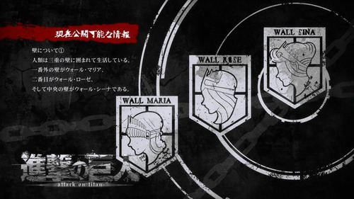

# AM8:30 テスト当日 #パラ高

<iframe src="https://www.youtube.com/embed/JfvbpGcwyc8" width="560" height="315" title="A YouTube video" frameborder="0" allowfullscreen></iframe>

### Context

This video is the first from a series called 私立パラの丸高校 (Paranormal High School). The setting takes place in a world where everyone has some form of power/ability.

### Transcript

黒い：なあひかる、なひかる

```
Hikaru, Hikaru
```

ひかる：なに

```
What
```

黒い：あの、アレあの、あの戦い何年だけ？

```
Uh.. um.. that.. when did that battle take place again?
```

ひかる：どの戦いだよ

```
What battle are you talking about?
```

黒い：あのほら、だん。。だ。。ダンジョン飯的な

```
Uh.. it's.. it's the one that sounds like "Dungeon Meshi"
```

> [Dungeon meshi](https://en.wikipedia.org/wiki/Delicious_in_Dungeon) is a manga series 

ひかる：１１８５年？

```
The year 1185?
```

黒い：あーそうだそうだ

```
Aah, that's right that's right
```

ひかる：壇ノ浦ね。あそういえば昨日さ

```
Dan-no-ura right? Oh by the way, yesterday... 
```

> This refers to the [Battle of Dan-no-ura](https://en.wikipedia.org/wiki/Battle_of_Dan-no-ura), a major sea battle from the [Genpei war](https://en.wikipedia.org/wiki/Genpei_War).

黒い：ちょっとまって、話しかけないで。覚えたこと抜けちゃうから

```
Wait. Stop talking for a bit. I'll forget what I'm learning if you do that
```

ひかる：あーうん

```
Uh.. alright
```

黒い：なあひかる、なひかる

```
Hikaru, Hikaru
```

ひかる：黒いお前ほんと自分勝手な奴だな

```
Kuroi, you're really selfish guy you know
```

黒い：問題出してくね？問題

```
Ask me questions
```

ひかる：まあいいけど

```
Eh, fine
```

黒い：助かるわ～

```
You've saved me there
```

ひかる：じゃあ。。鎌倉幕府の設立

```
Then, when was the Kamakura Shogunate established?
```

黒い：１１９２年

```
The year 1192
```

ひかる：すげえじゃん

```
Great, that was great
```

黒い：なめんなよ

```
Hehe, don't underestimate me
```

ひかる：じゃあ承久の乱

```
And what about the Jokyu war?
```

黒い：えー１２２１年

```
Uh.. the year 1221
```

ひかる：おー正解

```
Ooh.. that's right
```

黒い：おーよしよしよし

```
Let's goooo
```

ひかる：じゃあウォールマリアが突破された年

```
The year wall Maria was breached?
```

> "Wall Maria" here comes from the very popular series [Attack on Titan](https://en.wikipedia.org/wiki/Attack_on_Titan). It refers to the outermost wall that guards the Kingdom of Eldia 



黒い：８４５年。。マジでやめて

```
Year 845, and seriously.. stop it
```

ひかる：はや

```
That was quick..
```

黒い：マジで、漫画の情報今一番覚えちゃうから

```
Seriously, I already know too much about manga
```

ひかる：ごめん　ごめん

```
Sorry, sorry
```

黒い：頼むよ

```
I'm begging you
```

ひかる：じゃあ元寇何年と何年

```
Alright.. in which two years did the Mongols attempted to invade
```

黒い：えーっと、第二第四木曜日

```
Umm.. The second and fourth Thursday
```

ひかる：元寇毎月二回くんの？

```
Are you trying to say that the Mongols are invading us twice every month?
```

黒い：誰だよう「資源ごみはこの曜日ですよ」って紙教室に持ってきた奴。ふざけんなよ～

```
Who the hell brought a recyclable garbage pickup schedule to the classroom!?
```

ひかる：や、どういうこと？

```
Uh what's this about still?
```

黒い：いや俺の体さ「吸う」じゃん

```
Well you see, my body can suck things up
```

ひかる：あーお前の能力ブラックホールだもんな

```
Oh you're ability is "Black Hole" right?
```

黒い：そう俺の能力ブラックホールだから。で、割と吸引力強いからさ、テスト前余計な情報吸い込みがちなんだよね

```
Yeah that's right.. the suction force can get pretty strong so I tend to absorb unnecessary information before a test
```

ひかる：あ、概念も吸い込めるんだ。物質とか光とかだけじゃなくて

```
Oh, so you can absorb information too? Not only physical objects and light?
```

黒い：あ、ちょっと待って　今の会話でまた抜けたわ

```
Aaah, stop for a sec.. if we continue this conversation I'm going to forget things for the test
```

黒い：お、ちょっ　何すんだよ

```
Hey.. wait-what are you trying to do
```

ひかる：いやどうなんのかなって

```
Uh I was just wondering what would happen
``` 

黒い：Oh my god, I memorized every English and its meaning

```
あらゆる英単語とその意味覚えちゃたじゃん
``` 

ひかる：ペラペラになってんじゃん

```
Hey, you're actually speaking it well
```

黒い：最悪だよ～

```
That was real evil man
```

ひかる：ごめんて

```
Sorrry
```

黒い：俺が赤点取ったら責任とれよ～

```
You're taking responsibility if I fail my exam
```

ひかる：だからごめんて。。。歴史の教科書吸えよ

```
I said I was sorry... The history textbook, suck it in
```

黒い：その手があったか

```
Wait, you can actually do that!?
```

ひかる：なんで最初に気づかなかねえんだよ

```
Why the hell haven't you realized in the first place
```

黒い：灯台デモクラシーだなあ

```
It's lighthouse democracy
```

> Don't worry, you didn't read that wrong, the sentence is supposed to make no sense. Kuroi meant to say 灯台下暗し (toudai motokurashi) but he got a little mixed up with the words (probably from absorbing the English dictionary)
>
> 灯台下暗し is a Japanese idiom/phrase meaning the hardest thing to spot/realize is always right under your nose. He is saying this as a way of trying to justify himself for not realizing that he can just absorb his textbooks instead of studying
>
> Word for word, 灯台下暗し means "it is dark directly under a lamp post", i.e, it is dark where you would least expect it (or something like that).. check [this](https://www.linkedin.com/pulse/foot-lamppost-its-dark-yashar-kafi/) out if you want more info

ひかる：下暗しな

```
You meant to say "motokurashi" right?
```

黒い：やべ、もう完璧だわこれ

```
Dang, this is perfect
```

ひかる：冷静に、その能力あればテスト全部楽勝じゃん

```
Every test is gonna be a walk in the park.. that is, if you can use that ability correctly
```

黒い：ひかるも能力使えば

```
Hikaru, why don't you use your ability too?
```

ひかる：使えねえよ。俺、ただ光るだけだから

```
I can't. I, I can only light up
```

> The verb 光る meaning to light up is also pronounced "hikaru", just like the name. So.. that's the joke, it's a pun.

黒い：あ、そっか

```
Ah, I see
```

ひかる：笑うなよ

```
Don't laugh
```

黒い：ごめん

```
Sorry
```

ひかる：だから笑うなよ。マジで使えないんだぞこれ

```
Then don't laugh. Seriously, this ability is just useless
```

黒い：いや使えるよ！チャリのライトとか要らないじゃん

```
No it does have its uses! Like, you don't need bike lights for example
```

ひかる：チャリ要らない奴ばっかだよ。音速で移動できる奴とか、テレポートできる奴とか、周りそんなのばっかじゃん。なんで俺だけただ光るだけなんだよ

```
And even then there are people who don't need bikes at all. Like people who can move at the speed of sound, people who can teleport, they're all over the place. Why out of everyone am I the only one with this stupid ability
```

ひかる：ただ笑うなよ

```
I only just needed you to stop laughing
```

黒い：まって、しんどい

```
I can't take this anymore
```

ひかる：俺の方がしんどいよ

```
I'm the one that's suffering more over here
```

ｘ：ごめんひかる、ちょっと眩しいから光量抑えてくんね？

```
Sorry Hikaru its a bit too bright, can you tone it down a bit?
```

ひかる：ああ、ごめん

```
Aah, sorry
```

黒い：アレクサ？

```
Alexa?
```

> Do I even have to explain this joke? Fine, [Alexa](https://en.wikipedia.org/wiki/Amazon_Alexa) is a virtual home assistant. It has been the subject of [memes](https://knowyourmeme.com/memes/subcultures/alexa) and internet culture in general. Alexa performs various tasks according to voice commands like setting up an alarm or closing the lights, hence the joke with Hikaru being like Alexa

ひかる：だまれよ

```
Shut up
```