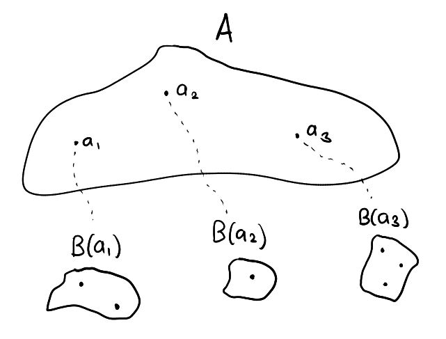
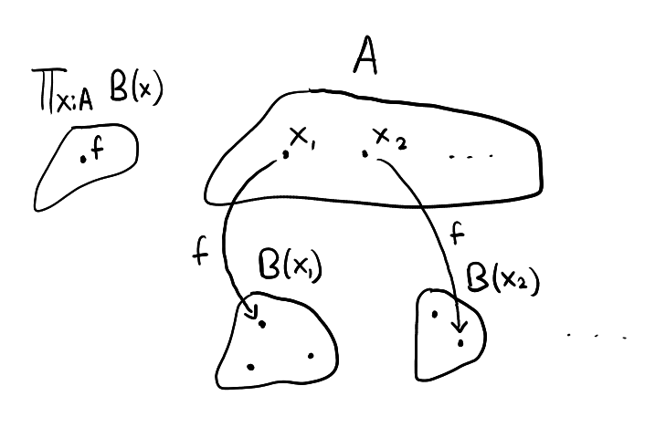
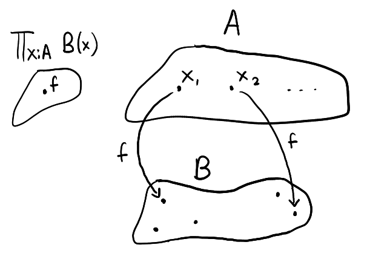

# Part 3 - Dependent Types
A dependent type is a type that is determined by the terms of some other type. For example, if `B` is a dependent type over `A:Type` with `a₁,a₂,a₃:A` then what type `B` is depends on which term of `A` is fed into it, that is, each `B(a₁), B(a₂), B(a₃)` are typically (but not necessarily) distinct types. The following diagram illustrates this

<figure markdown>
  { width="640" }
</figure>

We use the notation :

$$
x:A \vdash B(x):\text{Type}
$$

to mean "`B` is a dependent type over `A`". An example of a dependent type is `n:ℕ ⊢ vec(n):Type`. Depending on a term `n:ℕ`, we define `vec(n):Type` to be the type with terms consisting of n-dimensional vectors over $\mathbb{R}$. 

For example, `vec(2)` is a type consisting of the terms `[-1,0], [0,π] , etc..` and in `vec(3)` we have `[1,-2,3], [0,0,0], etc..` and so on..

> Of course there could be cases where `x:A ⊢ B(x):Type` but `B` is constant no matter what `x:A` we feed into it. It is still valid to call `B` a dependent type even in this scenario. More specifically, `B` is a constant dependent type. 

## Dependent Product Type

The idea is, given a dependent type `x:A ⊢ B(x):Type`, we would like to create a new type consisting of terms which maps any `a:A` to a term of type `B(a)`.

Again, to create this type we specify the four rules :

### **Type formation rule**

$$
\frac{x:\text{A} ⊢ \text{B}(x):\text{Type}}{\prod_{x:A} \ B(x) : \text{Type}}
$$

"Given a dependent type `B` over some `A:Type`, one may form the type `∏x:A B(x)`, called the dependent product type for `B`"

### **Term elimination rule**

$$
\frac{f:\prod_{x:A} B(x), \quad a:\text{A}}{f(a):B(a)}
$$

"Given a term `f` of the dependent product type and a term `a:A`, one may apply `f` to `a` to obtain a term of `B(a)`. The result of this application is written `f(a)`"

### **Term introduction rule**
How should we construct a dependent product type? The answer lies in lambda calculus. We shall provide a brief overview :

Given an expression `t` involving a free variable `x:A` (sometimes we write `t[x]` to make the involvement of `x:A` more explicit), we may form what is called a lambda abstraction :
$$
\lambda x:A, \ t
$$
The type of `t` may or may not depend on the choice of the free variable `x:A`, we can of course express this with a dependent type. We write `x:A ⊢ t[x]:B(x)` where `B` is some dependent type to mean that `t` is an expression involving a free variable `x:A` with the type `B(x)`

**Example:**
$$
\lambda x:ℕ, \ x+1
$$
here, the lambda abstraction consists of the free variable `x:ℕ` with the expression `x+1`. The expression's type in this case is not dependent on the choice of `x:ℕ`, of course `x+1` has type `ℕ` regardless of whatever `x:ℕ` is.

Given a lambda abstraction `λx:A, t[x]` where `x:A ⊢ t[x]:B(x)` and a term `a:A` one may apply this lambda abstraction to `a` to produce a term of type `B(a)`. The result of this application is denoted `λx:A, t[x] (a) := t[a]` where `t[a]` is the result of switching all instances of the free variable `x:A` in the expression with `a`. 

**For example :**
$$
(\lambda x:ℕ, \ x+1) \ (3) := 4+1
$$
Notice then that lambda abstractions are exactly what we want as the terms of our dependent product thus we come up with the following term introduction rule :
$$
\frac{x:\text{A} ⊢ t[x]:\text{B}(x)}{λx:\text{A}, \ t[x]:\prod_{x:\text{A}} B(x)}
$$
"Given `x:A ⊢ t[x]:B(x)`, i.e, an expression `t[x]:B(x)` involving `x:A` as a free variable, the lambda abstraction `λx:A, t[x]` is a term of the dependent product type"

### **Computation rule**
$$
\frac{a:\text{A}, \quad x:\text{A} ⊢ t[x]:\text{B}(x)}{λx:\text {A}, t[x] \ (a) := t[a] : B(a)}
$$

$$
\frac{f:\prod_{x:\text{A}} B(x)}{f := λx:\text{A}, f(x) : \prod_{x:\text{A}} B(x)}
$$

There are two computation rules which are mostly self-explanatory. The first one specifies that application of a lambda abstraction to a term is simply a substitution process. The second one states that any term of the dependent product type is itself a lambda abstraction. 

### Connection to the quantifier ∀

Let `x:A ⊢ B(x):Type` and `f:∏x:A B(x)`. Further suppose that the type `B(x)` is a predicate on `x:A`, for example if `A = ℕ` we could define `x:ℕ ⊢ B(x) := x<5`. 

> Remember that since `x<5` is a proposition it can be viewed as a type as well

Going back to the general case, what does the existence of an `f:∏x:A B(x)` indicate? If we have such a term on hand then we can apply `f` to any term `a:A` to obtain `f(a):B(a)` where `f(a)` can be viewed as a proof of the proposition `B(a)`, that is, for any `a:A`, `f` generates a proof of `B(a)`. Thus, because we have a term `f:∏x:A B(x)`, we know that `B(a)` is true for all `a:A`. In some sense, `f` is a proof of `∀a:A, B(a)`, and if we use the proposition as types interpretation then `∀a:A, B(a) := ∏x:A B(x) : Type`.

> Why is it called the dependent **product** type? Let us consider the case where there is a term `a:A` for which the proposition `B(a)` is not true, i.e, `B(a)` (viewed as a type) is empty. Then a term `f:∏x:A B(x)` is impossible to construct, i.e, the type `∏x:A B(x)` is empty. After all, `f` needs to map `a:A` to a term of type `B(a)` but there is none to map to. 
>
> We can think of `∏x:A B(x)` as the "multiplication" of all the `B(x)'s` for each `x:A`. All it takes is for one of those `B(x)'s` to be empty in order for `∏x:A B(x)` to be empty as well. Of course, this is analogous to arithmetic multiplication where if one of the terms in the product is zero, then the whole product is zero as well
>
> $$0 = 123 \times 6 \times 0 \times 23\times \cdots$$ 
>
> It is fitting then that an empty type be given the symbol `𝟘`, and the dependent product type uses `∏` in order to reflect the similarity with regular arithmetic.
## Function types

We finally define the function type. Given two types `A,B:Type` we may form the type `A→B:Type` whose terms consists of functions / mappings of terms from `A` to terms from `B`. It turns out that we don't have to do any more work in constructing such a type because it already comes for free as a special case of the dependent product type.

Let `x:A ⊢ B(x):Type` and `f:∏x:A, B(x)` as illustrated below

<figure markdown>
  { width="640" }
</figure>

Let us suppose we find out that `B` does not depend on `x:A`. This means that `B(x)` are all the same type for any `x:A`. Let's call this type simply `B`.. see what happens when the diagram reflects this change :

<figure markdown>
  { width="640" }
</figure>

It looks like `f` simply reduces to a function from `A` to `B` and likewise this implies that the type `∏x:A, B(x)` reduces to `A→B` if `B` is not dependent on `x:A`. 

I will not do it myself in this space but you may try to explicitly construct the function type anyway by specifying the four rules. It would be a good exercise to do so.

## Dependent Sum Type

While the dependent product type, `∏`, is analogous to `∀` the dependent sum type, `∑`, is analogous to `∃`. How do we want to create a type so that it matches the behaviour of `∃`? Suppose `x:A ⊢ B(x):Type` then `∑x:A, B(x) := ∃x:A B(x)` can be viewed as a type whose terms are proofs that there exists an `x:A` for which `B(x)` is true. 

A term (proof) of `∃x:A, B(x)` is thus composed of two parts. First, we'll need to provide some term `a:A`, then we need to provide a term `p:B(a)`, i.e, a proof of `B(a)`. This is how we will specify the term introduction rule.

Next, we'll need to figure out how to "use" a term  of `∃x:A B(x)`. If `q:∃x:A B(x)` then it makes sense that we should be able to extract from `q` a term `a:A` and a proof `p:B(a)`. This is how we will specify the term elimination rule.

### **Type formation rule**

$$
\frac{x:\text{A} ⊢ \text{B}(x):\text{Type}}{\sum_{x:A} \ B(x) : \text{Type}}
$$

"Given a dependent type `B` over some `A:Type`, one may form the type `∑x:A B(x)`, called the dependent sum type for `B`"

### **Term introduction rule**
$$
\frac{a:\text{A}, \quad p:\text{B}(a)}{(a,p):\sum_{x:\text{A}} \text{B}(x)}
$$
"Given some `a:A` and `p:B(a)`, the combination `(a,p)` is a term of the dependent product type."

### **Term elimination rule**

$$
\frac{q:\sum_{x:\text{A}} \text{B}(x)}{\pi_1(q):\text{A}, \quad \pi_2(q):\text{B}(\pi_1(q))}
$$

"Given a term `q` of the dependent sum type, one may decompose `q` back to the components they were constructed from as per the introduction rule. The functions `π₁` and `π₂` perform this action."

### **Computation rule**

$$
\frac{a:\text{A}, \quad p:\text{B}(a)}{\pi_1(a,p):=a:\text{A}, \quad \pi_2(a,p):=p:\text{B}(a)}
$$

$$
\frac{q:\sum_{x:\text{A}}\text{B}(x)}{q := (\pi_1(q), \pi_2(q)):\sum_{x:\text{A}}\text{B}(x)}
$$

and here are the straightforward computation rules for the dependent sum type.

The following diagram illustrates the dependent sum type :

<figure markdown>
  { width="640" }
</figure>

> Like the dependent product type, the dependent sum type can be thought of as "summing" all the `B(x)'s` for each `x:A`, so it makes sense that all of the `B(x)'s` would need to be empty for the total sum, `∑x:A B(x)`, to be empty as well.

[**Previous Section**](part2.md)

[**Next Section**](part4.md)