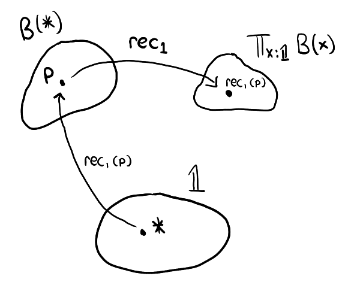
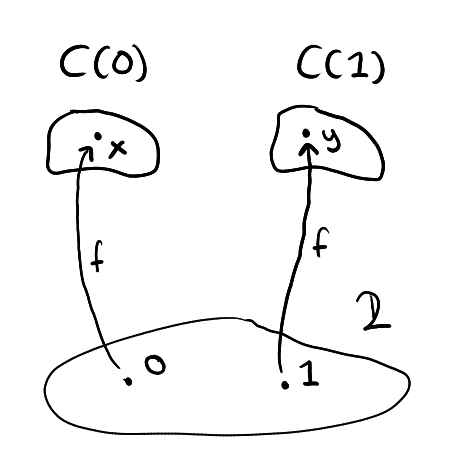

# Part 4 - More Types

Now that we have covered dependent types this gives us more freedom of expression to define new types and redefine old ones. For example, dependent types allows us to provide an alternative term elimination rule for the empty type.

Recall that in set theory :

$$
\forall x\in \varnothing, \ \text{B}(x)
$$

is true for any predicate $\text{B}$. If we interpret $\forall$ as the dependent product type, $\varnothing$ as the empty type and $\text{B}$ as a dependent type then we get the following rule :

$$
\frac{x:0\vdash \text{B}(x):\text{Type}}{\text{rec}_0:\prod_{x:0} \ \text{B}(x)}
$$

"Given a dependent type `B` over `𝟘`, we obtain a term of type `∏x:𝟘 B(x)`." Such a term corresponds to the [empty function](https://en.wikipedia.org/wiki/Function_(mathematics)#empty_function). The elimination rule here and the one presented earlier are essentially equivalent. 

## The Unit Type

We would like to create a type which has only one term, this type will be called the unit type and be given the symbol `𝟙`.

### Type formation rule

$$
\frac{}{1:\text{Type}}
$$

### Term introduction rule

$$
\frac{}{*:1}
$$

"The unit type is equipped with the sole term `*:𝟙`"

### Term elimination rule

> Now that we have discussed dependent types we can talk about the elimination rule more generally. For **most** (but not all) types `A` the elimination rule has to specify, given any dependent type `B` over `A`, a construction of a term of type `∏x:A B(x)`. 

To construct a term of type `∏x:𝟙 B(x)` is equivalent to proving that `B(x)` is true for all `x:𝟙`, but since there is only 1 term `*:𝟙` then logically speaking we would only need to prove (contruct a term of) `B(*)` to obtain a term of `∏x:𝟙 B(x)`.    

Thus, we come up with the following elimination rule :

$$
\frac{x:1 \vdash \text{B}(x):\text{Type}}{\text{rec}_1:\text{B}(*) \to \prod_{x:1} \text{B}(x)}
$$

"Given a dependent type `B` over `𝟙`, there is a term `rec₁` of type `B(*) → ∏x:1 B(x)`. Feed `rec₁` a term of `B(*)` and you will obtain a term of type `∏x:𝟙 B(x)` as desired."

### Computation rule

$$
\frac{x:1 \vdash \text{B}(x):\text{Type}, \quad p:\text{B}(*)}{\text{rec}_1(p,*):=p:\text{B}(*)}
$$

It appears as if `rec₁` is taking in two inputs at once but it is actually doing it one at a time. First, `p:B(*)` is fed into `rec₁` to create `rec₁(p) : ∏x:𝟙 B(x)`. Then, to `rec₁(p)` we feed `*:𝟙` to create `rec₁(p)(*):B(*)`, which by the rule above simplifies back to `p:B(*)` again. When a function takes in multiple inputs one at a time as in the above, we simplify the notation like so `rec₁(p)(*) → rec₁(p,*)`, removing unnecessary brackets.

The following diagram illustrates this computation rule :

<figure markdown>
  { width="640" }
</figure>

## Bool Type

You've guessed it, we've created a type with zero terms, a type with one term, now it's time for a type with two terms, the bool type. Let's give it the symbol `𝟚:Type` and terms `0,1:𝟚`.

> Type formation and term introduction rules skipped because they should be obvious by now

### Term elimination rule

$$
\frac{x:2\vdash \text{C}(x):\text{Type}}{\text{rec}_2:\text{C}(0)\to \text{C}(1)\to \prod_{x:2}\text{C}(x)}
$$

### Computation rule

$$
\frac{x:2\vdash \text{C}(x):\text{Type}, \quad c_0:\text{C}(0), \quad c_1:\text{C}(1)}{\text{rec}_2(c_0,c_1,0):=c_0 : \text{C}(0), \quad \text{rec}_2(c_0,c_1,1):=c_1 : \text{C}(1)}
$$

Alright, let's break this down. A term of `∏x:𝟚 C(x)` is supposed to map `0:𝟚` to a term of type `C(0)` and map `1:𝟚` to a term of type `C(1)`. So to construct a term of `∏x:𝟚 C(x)`, all we need to do is specify the terms that `0,1:𝟚` will map to. 

`rec_𝟚`, is simply the function that takes in those specifications, i.e, a term of `C(0)` and a term of `C(1)`, and outputs a term of `∏x:𝟚 C(x)` based on the provided specification. 

Suppose `x:C(0)` and `y:C(1)` and we feed these into `rec_𝟚` to get `f := rec(x,y) : ∏x:𝟚 C(x)`. The diagram below illustrates how `f` behaves.

<figure markdown>
  { width="640" }
</figure>

## Sum Type

Recall that the dependent sum type `∑x:A B(x)` can be thought of as the sum over all `B(x)'s` for each `x:A`. If `A:Type` consists only of 2 terms, say `A := 𝟚`, then `∑x:A B(x)` can be thought of as adding two types, `B(0)` and `B(1)` together, i.e, 

```
∑x:𝟚 B(x) := B(0) + B(1)
```
Let us explore some properties of the type `B(0) + B(1)`. First is that `B(0) → B(0) + B(1)` is inhabited, i.e, we can construct a term of that type :
```
λx:B(0), (0,x) : B(0) → B(0) + B(1)
```
Similarly, `B(1) → B(0) + B(1)` is inhabited. This is similar to how $A \to A \lor B$ and likewise $B \to A \lor B$ are true in propositional logic. Thus `+` corresponds to $\lor$, another connection between type theory and logic!

> $\neg A$ from propositional logic corresponds to the type `A→𝟘`. This makes sense because a term `p:A→𝟘` can be thought of as a proof that `A` is empty, i.e, false. This is because the existence of a `p:A→𝟘` contradicts with the existence of an `a:A` since otherwise we can combine them to form `p(a):𝟘`. Thus, for any `A:Type` we shall write `¬A` as shorthand for `A→𝟘`.   

## Product type

We can repeat the same idea to construct, for any types `A,B:Type`, their product `A × B:Type`. I will leave you to fill in the rest of the details yourself, it is not too difficult to make sense of. (obvious hint: this corresponds to $\land$ from logic)

Notice that `∑x:A B(x)` degenerates to `A × B` if `B` does not depend on `x:A`[^1] 


<!--
## The First Theorem

Let us introduce and prove the first theorem of this series :

> Theorem. Let `A,B,C:Type`, then the type
>
> ```
>                (A + B) → (A → C) → (B → C) → C
> ```
> is inhabited (has a term).

> What is the significance of this theorem? Viewed as propositions instead of types, the theorem states that : if we have a proof of `A + B` and we wish to prove `C` then it suffices to prove both `A → C` and `B → C`. This is the principle of proof by cases. 

Proof. First let us construct the dependent types :

```
x:𝟚 ⊢ D(x):Type, D(0) := A, D(1) := B

x:𝟚 ⊢ E(x):Type, E := λx:𝟚, D(x) → C
```
We can then rewrite our goal into
```
                 ∑x:𝟚 D(x) → E(0) → E(1) → C
```
Essentially what we want to do is construct a function that takes in a term of type `∑x:𝟚 D(x)`, a term of type `E(0)`, and a term of type `E(1)` and returns a term of type `C`. We also know that the construction a function involves making use of a lambda abstraction, so let us start with the following template :

```
λh1:(∑x:𝟚 D(x)), λh2:E(0), λh3:E(1), [something]
```

By applying the elimination rule of `𝟚:Type` with the dependent type `E` we obtain

```
rec₂ : E(0) → E(1) → ∏x:𝟚 E(x)
```
via the elimination rule for `∑` we can decompose `h1:∑x:𝟚 D(x)` as follows:
```
π₁(h1) : 𝟚,   π₂(h1) : D(π₁(h1))
```
Given terms `h2:E(0)` and `h3:E(1)` :
```
rec₂(h2,h3,π₁(h1)) : E(π₁(h1)) := D(π₁(h1)) → C

-- and hence --

rec₂(h2,h3,π₁(h1),π₂(h1)) : C
```

We can now fill in the previously unknown `[something]` :

```
λh1:(∑x:𝟚 D(x)), λh2:E(0), λh3:E(1), rec₂(h2,h3,π₁(h1),π₂(h1))
```
The above is a term of `∑x:𝟚 D(x) → E(0) → E(1) → C`, thus `(A + B) → (A → C) → (B → C) → C` is inhabited as required. ∎
-->

[**Previous Section**](part3.md)

[**Next Section**](part5.md)

[^1]: see [this](https://cs.stackexchange.com/questions/81112/why-product-type-is-a-dependent-sum)