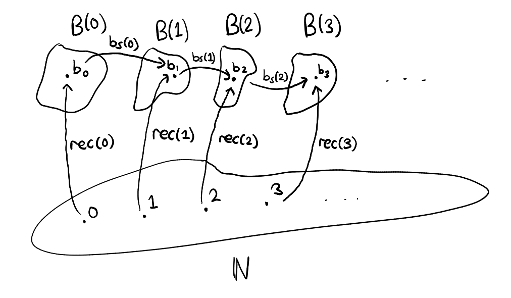

# Part 5 - The Natural Numbers

It is now time to properly define `ℕ:Type`, the type of natural numbers. We specify the term introduction rule as follows: there is a term `0:ℕ` and given any `n:ℕ` we can obtain the "next" natural number by applying a successor function `s:ℕ→ℕ`

### Term introduction rule

$$
\frac{}{0:\mathbb{N}} \quad \quad \quad \frac{n:\mathbb{N}}{s(n):\mathbb{N}}
$$

> With `1 := s(0), 2:= s(s(0)), ...` and so on...
### Term elimination rule

Given a dependent type `n:ℕ ⊢ B(n):Type`, we need to specify how to construct a term of type `∏n:ℕ, B(n)`. To do so, we just need to apply ideas from natural number induction and translate them into the language of type theory. Doing so gives us the following, we require :

- a term of `B(0):Type`
- given any `n:ℕ` and `p:B(n):Type`, a construction of a term of `B(s(n)):Type`.

in order to construct a term of type `∏n:ℕ, B(n)`. Thus we infer the following elimination rule :

$$
\frac{n:ℕ \vdash \text{B}(n):\text{Type}, \quad b_0:\text{B}(0), \quad b_s:\prod_{n:\mathbb{N}}\text{B}(n)\to \text{B}(s(n))}{rec_\mathbb{N}(b_0,b_s):\prod_{n:\mathbb{N}}\text{B}(n)}
$$

Alternatively we could have removed `b₀:B(0)` and `bₛ:∏n:ℕ, B(n) → B(s(n))` from the top and replaced the bottom with

```
rec_ℕ : B(0) → [∏n:ℕ, B(n) → B(s(n))] → [∏n:ℕ, B(n)] 
```

both versions are equivalent. I just find the top one a bit cleaner.

When `B(n)` does not actually depend on the choice of `n:ℕ` then we get the simplified version :

$$
\frac{\text{B}:\text{Type}, \quad b_0:\text{B}, \quad b_s:\mathbb{N}\to \text{B}\to \text{B}}{rec_\mathbb{N}(b_0,b_s):\mathbb{N}\to \text{B}}
$$

which is useful for defining operations on `ℕ`, as an example we show how to define a function `double:ℕ→ℕ` that doubles numbers. But first, we introduce the computation rules.

### Computation rules

$$
\frac{n:ℕ \vdash \text{B}(n):\text{Type}, \quad b_0:\text{B}(0), \quad b_s:\prod_{n:\mathbb{N}}\text{B}(n)\to \text{B}(s(n)), \quad n:\mathbb{N}}{rec_\mathbb{N}(b_0,b_s,0):=b_0:\text{B}(0), \quad rec_\mathbb{N}(b_0,b_s,s(n)):=b_s(n, rec_\mathbb{N}(b_0,b_s,n)):\text{B}(s(n))}
$$

here is a diagram to illustrate (we simplify `rec_ℕ(b₀,bₛ) := rec`) :

<figure markdown>
  { width="640" }
</figure>

### Doubling function

A doubling function on the natural numbers is a function `Double:ℕ→ℕ` saatisfying `Double(n) := 2n` for all `n:ℕ`. Such a function can be constructed by using the simplified elimination rule on `ℕ` with `B := ℕ` and supplying a suitable `b₀:ℕ` and `bₛ:ℕ→ℕ→ℕ` so that `rec_ℕ(b₀,bₛ) := Double`. 

Figuring out how to select a suitable `b₀` and `bₛ` is easy. We just have to apply the computation rules and fill in the blanks. Suppose we have been given suitable `b₀` and `bₛ` but without knowledge of their values, then the first computation rule gives :

```
rec_ℕ(b₀,bₛ,0) := Double(0) := b₀
```

Obviously we want `Double(0) := 0` so we must select `b₀ := 0`. Figuring out `bₛ` is a bit harder. Given any `n:ℕ`, the second computation rule states that

```
rec_ℕ(b₀,bₛ,s(n)) := bₛ(n,rec_ℕ(b₀,bₛ,n))
  --- simplifies to
Double(s(n)) := bₛ(n,Double(n))
```
But notice that for any `n:ℕ`
```
Double(s(n)) := Double(n+1)
             := 2n + 2
             := s(s(Double(n)))
  --- thus
bₛ(n,Double(n)) := s(s(Double(n)))
```
So it is clear now that we must select `bₛ := λn:ℕ,λm:ℕ, s(s(m))`. Notice that the first input of `bₛ` is irrelevant to the computation but it must be included anyway to ensure that `bₛ` has the type `ℕ→ℕ→ℕ` as needed, lest we have `bₛ:ℕ→ℕ`.

> Hang on! `Double(s(n)) := s(s(Double(n)))` is not something we can determine with our type system just yet.. we haven't even defined `+` in our type system.
>
> That's right, we don't know that `Double(s(n)) := s(s(Double(n)))` is true, we just went ahead of ourselves and did some pretend arithmetic.. but that is to figure out how we **need** `Double` to behave recursively, i.e, how to define `Double(s(n))` in terms of `Double(n)`. 
>
> Once done, we select `bₛ` specifically to ensure that `Double(s(n)) := s(s(Double(n)))`, the recursive property we want true, holds by virtue of the computation rule.

Here is the doubling function in full, constructed from scratch :

```
Double := rec_ℕ(0,[λn:ℕ,λm:ℕ, s(s(m))])
```
> As an exercise, try to verify that `Double(3) := 6` by unfolding the definitions and repeating the computation rules.

We can construct many other functions by following the same process. As another example, we will construct the addition function `+:ℕ→ℕ→ℕ`.

### Addition function

We do the same thing all over again but with `B := ℕ → ℕ` this time. This will be a lot more difficult, but the principle is the same. First, notice that
```
rec_ℕ(b₀,bₛ) := +  --- hence
rec_ℕ(b₀,bₛ,0) := + 0
```
Wait a moment! what the hell is `+ 0` ??? How does this make sense? I acknowledge that this is all a bit unconventional but I promise it makes sense, give me a chance to explain.

Let's ask the simple question first : What is the type of `+ 0`? Well, given that `+:ℕ→ℕ→ℕ` and `0:ℕ`, we must have `+ 0:ℕ→ℕ`. This is simply the elimination rule for the function type. Moreover, one of the computation rules state that :

```
+ := λn:ℕ,λm:ℕ, +(n,m)
```

where `+(n,m) := n + m`, this is simply writing `+` with the [Polish notation](https://en.wikipedia.org/wiki/Polish_notation) which does nothing but to emphasize that `+` is indeed a function. This is helpful because most education systems present and teach `+` as an operator, and the infix notation `n + m` makes it harder to make the connection that `+` can be thought of as a function. 

It is not that `+` being an operator is untrue, but rather that "operator ⊆ function" and we wish to look at things from a broader perspective. 

Going back on topic, this means that

```
+ 0 := λm:ℕ, +(0,m) := λm:ℕ, m
```

So it is clear that `+ 0 := Id_ℕ` where `Id_ℕ:ℕ→ℕ` is the identity function (leaves output unchanged) on `ℕ`. Hence `b₀ := Id_ℕ`.

To tackle defining `bₛ` we first introduce function composition :

> Definition. Given types `A, B, C` and `f:A→B, g:B→C` we shall write `g∘f:A→C` as short hand for the lambda abstraction `λa:A, g(f(a))`. 

Now notice that for any given `n:ℕ` the second computation rule gives the equality :
```
+ s(n) := bₛ(n,+ n)
```
but notice that
```
+ s(n) := λm:ℕ, s(n) + m
       := λm:ℕ, n + s(m)
       := [λm:ℕ, n + m] ∘ s
       := (+ n) ∘ s
```
thus, we define `bₛ := λn:ℕ, λf:ℕ→ℕ, f∘s`. 

> Again, the first input is useless, it actually only becomes useful when we apply the original (actually dependent) version of the elimination rule for `ℕ`. 

You can verify that indeed for these choices of `b₀` and `bₛ`, a function that models addition is constructed. Here is how we would compute `2+1` for example

```
2 + 1 := (+ 2) (1)
      := (+ 1) ∘ s (1)
      := (+ 1) (2)
      := (+ 0) ∘ s (2)
      := (+ 0) (3)
      := 3
```

### Order

I'll be brief here as I don't want to discuss all aspects of arithmetic. For any `n,m:ℕ` the statement `n<m` is a proposition and so can be thought of as a type. How about we define

$$ n≤m := \sum_{x:\mathbb{N}}(m=n+x) $$

Of course this implies that `m=n+x` is a type, and we haven't discussed identity types yet (honestly its a confusing topic and I'm not sure if I want to), but you get the point: to construct a proof (term) of the type `n≤m` one must provide an `x:ℕ` along with a proof `q:m=n+x`. 