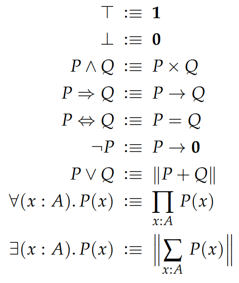

# Part 8 - Propositional Truncation

**Type Formation Rule**

$$\frac{\text{A}:\text{Type}}{\text{|A|}:\text{Type}}$$

For any type `A` we introduce the type `|A|`, called the propositional truncation of `A`. 

**Term Introduction Rule**

$$\frac{\text{A}:\text{Type}}{\text{inc}:\text{A}\to\text{|A|}}$$

There is a function `inc:A→|A|`, this ensures that we have: `|A|` is inhabited whenever `A` is 

> because we can create an inhabitant of `|A|` by applying `inc` to an inhabitant of `A`. 

**Observational Equality**

$$\frac{a,b:\text{|A|}}{p:a=b}$$

Any two terms of the propositional truncation are equal. Obviously this means that `|A|:Prop` for any `A:Type`.

**Term Elimination Rule**

$$\frac{\text{A}:\text{Type}, \quad \text{B}:\text{Prop}, \quad f:\text{A}\to\text{B}}{g:\text{|A|}\to \text{B}}$$

> A dependent version of the above rule exists, but is not particularly useful

with the **computation rule** `g(|a|):=f(a)` for any `a:A`. The elimination rule basically means that when attempting to prove that a propositional truncation `|A|` implies a proposition `B`, then it suffices to prove (the often easier) `A` implies `B`. 

### The solution

to our problem in the previous part is to apply a propositional truncation whenever an operation between two propositions `A,B:Prop` results in a type that isn't a proposition. 

The only troublesome operations to worry about is `+` and `∑`. Therefore, if we want to translate `A∨B` into type theory, we use `|A+B|` instead of the usual `A+B`. 

> Again, `A∨B→A+B` is not an incorrect translation, rather `A+B` is a constructive version of `A∨B`. If we are working under the context of intuitionistic logic, then the translation would in fact be accurate.

Here is a full translation table given `P,Q:Prop` except the last two rows where `P:A→Prop`.

<figure markdown>
  { width="640" }
</figure>

### Differences

To better understand propositional truncation, let us examine the differences between `∑x:A, P(x)` and `∃x:A, P(x)`.

Surely `∑x:A, P(x) → A` is inhabited. `π₁` (from the elimination rule for dependent sum types) for example is an inhabitant of that type. This means that we can extract an inhabitant of `A` given a term of `∑x:A, P(x) → A`, we can then use that inhabitant of `A` in a proof argument later on. Would the same thing work for `∃x:A, P(x)`?

According to the elimination rule, a function `g:∃x:A, P(x) → A` can be obtained from `π₁:∑x:A, P(x) → A`, but this is supposing that `A` is an h-proposition which is not always the case. What we can guarantee however is that `g:∃x:A, P(x) → |A|` is inhabited since we have `|A|:Prop` by definition. So we can extract an inhabitant of `|A|` instead of `A`. 

Whilst the judgement `a:A` demonstrates that `A` is inhabited, it also provides us access to a term of `A` that we can make use of. Meanwhile, the judgement `a:|A|` only has the benefit of demonstrating that `A` is inhabited.. and nothing else.

You may imagine that it will be troublesome to work with `∃x:A, P(x)`. For example, one can imagine a situation where the next step of a proof requires proving `B:Type` whilst having an `f:A→B` at hand. It is easy to do so starting from `q:∑x:A, P(x)` because `f(π₁(q)):B`. If instead we have `q:∃x:A, P(x)` then we can extract an `a:|A|` but we would be stuck since `a:|A|` can't be fed into `f:A→B`. 

Trouble as it may be, most statements in (classical) mathematics can be represented as h-propositions. That is to say, if we encounter a similar situation (as described above), it will often be the case that `B:Prop`. Since that is the case, our `f:A→B` can be converted to a `g:|A|→B`, thus allowing us to proceed with the proof.

Even then, having to take this additional step every single time is arduous. In [Lean](https://leanprover-community.github.io/mathlib_docs/init/classical.html), there is an axiom should you wish to work under classical mathematics. It asserts that given any `A:Type` a function

```
classical.choice : |A| → A
```

exists. Although unnecessary, this basically allows us to sort of sweep under the rug the additional work and detail required when dealing with propositional truncations. In particular, we can treat `∃x:A, P(x)` as if it were (the more useful) `∑x:A, P(x)`. 

### if-then-else statments

Now that we're more familiar with propositions, let us introduce a use case. Propositions, in particular the principle of LEM, allow us to model if-then-else statements in type theory. As a reminder, LEM asserts the existence of a function:

```
LEM : ∏A:Prop, A + ¬A
```

Given `A:Prop`, `B:Type`, `x:A→B`, and `y:¬A→B` we use the elimination rule for the sum type, `match`, to define:

```
dite A x y := match(LEM(A),x,y) : B
```

or if `x,y:B` then

```
ite A x y := match(LEM(A),[λp:A, x],[λp:¬A, y]) : B
```

Thus, `dite` can be thought of as the dependent version of `ite`. Let us showcase an example, suppose we want to show that

```
ite 1<2 0 1 = 0
```

For simplicity's sake suppose we already have a proof `q:1<2`, then `inl(q):1<2 + ¬(1<2)`, and according to the observational equality rule for propositions, we have the propositional equality `LEM(1<2)=inl(q)`.

By definition,

```
ite 1<2 0 1 := match(LEM(1<2), [λp:1<2, 0], [λp:¬1<2, 1])
```

We can replace `LEM(1<2)` with `inl(q)`, then the computation rule reduces the `match` expression to

```
[λp:1<2, 0](q) := 0
```

If we had come up with a proof `q:¬1<2` instead you can imagine that `ite 1<2 0 1` will reduce to `1` instead of `0`. Hence, we can think of `ite 1<2 0 1` as the statement:

```
if 1<2 then 0 else 1
```

`ite` is the if-then-else of the type theory universe (with `dite` being the dependent version).